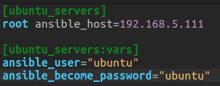
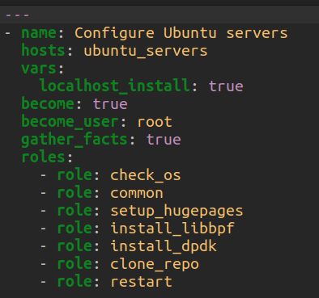
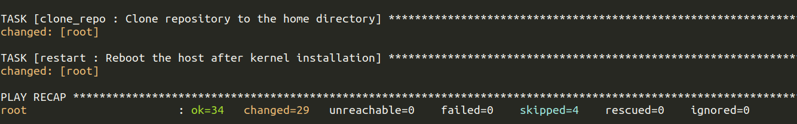

# Infra-Automation
Ansible playbook to automate infra

## Steps to configure on Host Machine:
1. Clone the repository using:

```bash
https://github.com/NgKore47/Infra-Automation.git
```

2. Make changes to [inventory.ini](./inventory.ini) file

    

> **Note:** Change the host name, ip and password according to the target machine.

3. Make changes to [playbook.yml] file:
- Select the roles that you want to execute through this playbook
    
    

4. Make sure that host is able to access the target server via `ssh`:

```bash
# change the IP with you target server's IP
ssh-copy-id ubuntu@192.168.5.111
```

5. Run the ansible playbook from the host machine using:

```bash
ansible-playbook -i inventory.ini playbook.yml
```

6. On successful completion of the process, you will get the output something like this:

